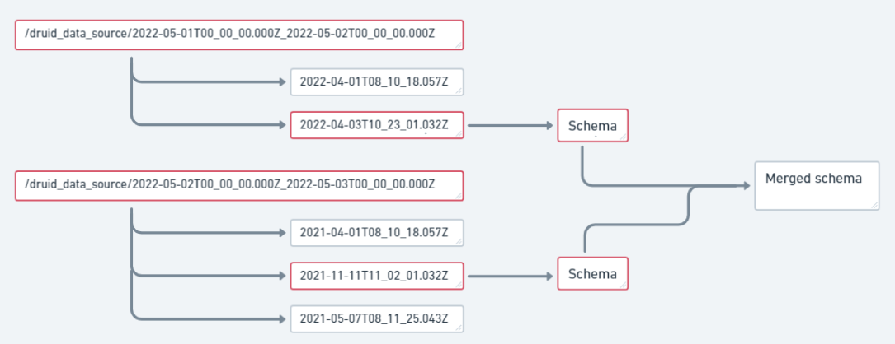

# Spark Druid Segment Reader #

[](https://github.com/deep-bi/spark-druid-segment-reader/actions/workflows/scala.yml)

## Quick summary

__Spark Druid Segment Reader__ is a Spark connector that extends Spark DataFrame reader and supports directly reading
Druid data from PySpark.
By using DataSource option you can easily define the input path and date range of reading directories.

The connector detects the segments for given intervals based on the directory structure on Deep Storage (without
accessing the metadata store). For every interval only the latest version is loaded. Data schema of a single segment
file is inferred automatically. All generated schemas are merged into one compatible
schema.

Example visualization of creating a merged schema for two directories with `start_date: "2022-05-01"`
and `end_date: "2022-05-03"`:



## Usage (PySpark)

If you want to execute this connector in Spark, first you need to build that project using `sbt assembly`.

To work with custom jar, add a `"spark.jars"` parameter to Spark Context, e.g.

```python
from pyspark.sql import SparkSession, SQLContext

sc = (
    SparkSession.builder
    .config("spark.jars", spark_druid_segment_reader_jar_path)
    .getOrCreate().sparkContext
)
```

To load a `DataFrame` from Druid segments use:

```python
sqlContext = SQLContext(sc)
dataFrame = sqlContext.read.format("druid-segment").options(**properties).load()
```

where `properties` is a dictionary containing read configuration.

### Read options ###

|   Parameter name    |  Type   |                                     Format/Description                                     | Required |                       Default                        |
|:-------------------:|:-------:|:------------------------------------------------------------------------------------------:|:--------:|:----------------------------------------------------:|
| `druid_data_source` | String  |                     name of the directory where druid data are located                     |   Yes    |                          -                           |
|    `start_date`     | String  |                                       `"YYYY-MM-DD"`                                       |   Yes    |                          -                           |
|     `end_date`      | String  |                                       `"YYYY-MM-DD"`                                       |   Yes    |                          -                           |
|  `druid_timestamp`  | String  | name of the additional output column representing the timestamps extracted from druid rows |    No    | druid row timestamp is not added to the final schema |
|    `input_path`     | String  |                           full path to druid_data_source folder                            |   Yes    |      `"s3a://s3-deep-storage/druid/segments/"`       |
| `temp_segment_dir`  | String  |            full or relative path to temporary folder which will store segments             |    No    |                   `/tmp/segments`                    |

Example:

```python
propertiesDir = {
    "data_source": "druid_segments",
    "start_date": "2022-05-01",
    "end_date": "2022-05-10",
    "druid_timestamp": "druid-timestamp",
    "input_path": "s3a://s3-deep-storage/druid/segments/",
    "temp_segment_dir": "/tmp/segments/"
}
```

### Set up S3 connection

If you want to read druid segments directly from S3, you have to add the required credentials to the Spark Context,
e.g.:

```python
sc._jsc.hadoopConfiguration().set("fs.s3a.endpoint", endpoint)
sc._jsc.hadoopConfiguration().set("fs.s3a.access.key", access_key)
sc._jsc.hadoopConfiguration().set("fs.s3a.secret.key", secret_key)
sc._jsc.hadoopConfiguration().set("fs.s3a.path.style.access", "true")
```

## Segment version selection

The connector automatically detects the Apache Druid segments based on the directory structure on Deep Storage (without
accessing the metadata store). Similarly as in Apache Druid, for every interval only the latest version is loaded. Any
segment granularity is supported, including mixed (e.g. hourly with daily).

For example, if the storage contains the following segments:

```
1     2     3     4     5     <- Intervals
| A 1 | B 2 | C 3 | E 5 |
|    D 4    |
```

C, D, and E segments would be selected, while A and B would be skipped (as they were most likely compacted into D,
that has a newer version).

Thus even if multiple versions of the data exist on the storage, only one version (latest) will be loaded (without
duplicates).

## Current limitations

- The connector is reading only the dimensions and primitive types of metrics.
- Apache Spark 3.x is not supported yet (the latest release is compatible with Apache Spark 2.4 only)
